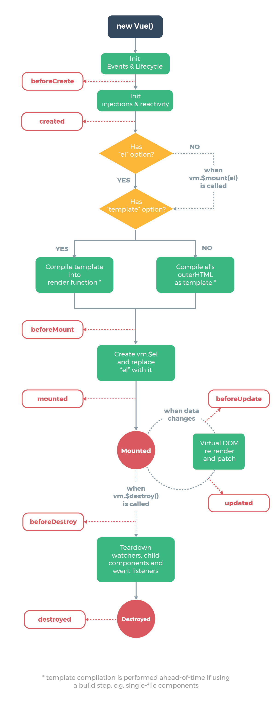

### 生命周期方法

组件在被创建出来到渲染完成会经历一系列过程，同样组件的销毁也会经历一系列过程，组件从创建到销毁的这一系列过程被称为`组件的生命周期`。

在 Vue 中，组件生命周期的节点会被定义为一系列的方法，这些方法称为`生命周期钩子`。有了这些生命周期方法，我们可以在合适的时机来完成合适的工作。



[生命周期示例](t/01_life.html)

[组件卸载示例](t/01_unmount.html)

当组件中的 HTML 元素发生渲染或更新时，会调用 `renderTriggered`、`renderTracked`、`beforeUpdate`、`updated` 方法。

[渲染与触发示例](t/01_render_update.html)

### 应用的全局配置选项

当调用 `Vue.createApp` 方法后，会创建一个 Vue 应用实例，该实例内部封装了一个 `config` 对象，可以通过对这个对象的一些全局选项对实例进行配置。常用的配置项有异常与警告捕获配置和全局属性配置。

在 Vue 应用运行过程中，难免会有异常和警告产生，可以使用自定义的函数来对抛出的异常和警告进行处理:
```js
    const App = Vue.createApp({})
    App.config.errorHandler = (err, vm, info) => {
        // 捕获运行中产生的异常
        // err 参数是错误对象，info 为具体的错误信息
    }
    App.config.warnHandler = (msg, vm, trace) => {
        // 捕获运行中产生的警告
        // msg 是警告信息，trace 是组件的关系回溯
    }
```

实际开发中，有些数据可能是全局的，例如应用名称、应用版本信息等。为了方便地在任意组件中使用这些全局数据，可以通过 `globalProperties` 全局属性对象进行配置:
```js
    const App = Vue.createApp({})
    // 配置全局数据
    App.config.globalProperties = {
        version: '1.0.0'
    }
    const sub = {
        mounted() {
            // 在任意组件的任意地方都可以通过 this 直接访问全局数据
            console.log(this.version)
        }
    }
```

### 组件的注册方式

组件的注册方式分为全局注册与局部注册两种。直接使用应用实例的 `component` 方法注册的组件是全局组件，即可以在应用内的任何地方使用这些组件，包括其他组件内部。

[全局组件示例](t/01_global_component.html)

为了避免组件的全局污染，可以通过局部方式注册组件。

[局部组件示例](t/01_local_component.html)
